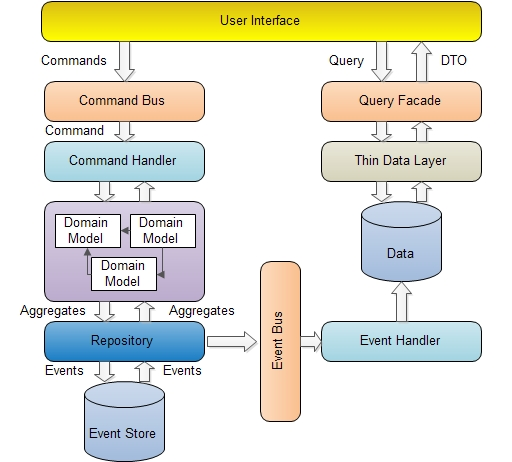
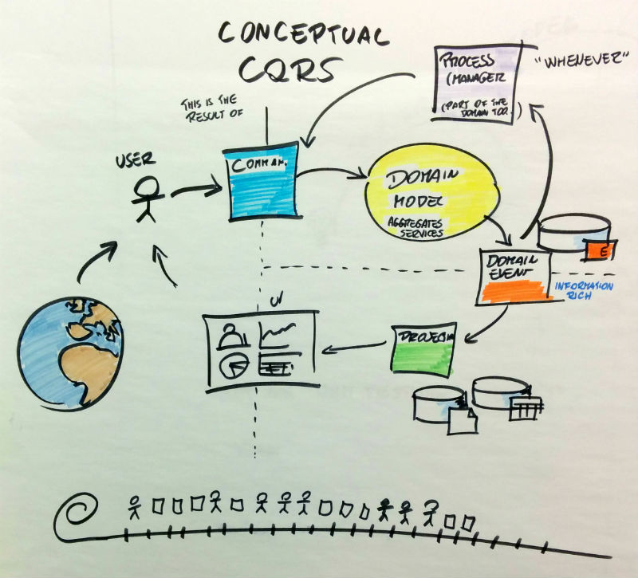

# Projektowanie i implementacja zaawansowanych aplikacji PHP

## Wykład 8: Event Storming

### Zakres:

- Event Storming
    - Struktura sesji modelowania
    - Role uczestników
        - Facilitator, osoba prowadząca i koordynująca sesję
        - Zespół, osoby modelujące, prowadzące dyskusję nad domeną
    - Poziom Big Picture
        - Notacja
            - Event, zdarzenie, fakt
                - Opisuje zdarzenie domeny, które zaszło w domenie
                - Opisany czasem przeszłym, dokonanym
                - Istotny z perspektywy biznesowej 
            - Hot-spot
                - "Zaparkowana dyskusja"
                - Problemy i pytania, na które brak odpowiedzi w danej chwili
            - Aktor
                - Osoba biorąca udział w procesie
            - Polityka
                - Reaktywna logika biznesowa, proces
            - Zewnętrzny system
            - Głosowanie
                - Wskazywanie istotnych problemów z perspektywy poszczególnych osób
        - Etapy:
            - Etap 1: Wild Exploration, odkrywanie zdarzeń biznesowych
            - Etap 2: Enforce The Timeline, porządkowanie zdarzeń w procesy
            - Etap 3: Reverse Narrative, kontrola spójności zdarzeń
            - Etap 4: Add Users & Systems, odkrywanie aktorów i systemów
            - Etap 5: Choose The Right Problem, podejmowanie decyzji projektowych
        - Typowe zastosowanie
            - Modelowanie procesów
            - Odkrywanie zdarzeń domenowych
            - Odkrywanie bounded-contextów
            - Identyfikacja problematycznych miejsc
            - Uspójnianie wiedzy w zespole
    - Poziom Design Level
        - Notacja
            - Command
                - Decyzja / rozkaz dla systemu
                - Opisany trybem rozkazującym
            - Agregat
                - Obiekt biznesowy, posiada i kontroluje niezmienniki
            - Read Model
                - Model danych dedykowany do odczytu
                - Może być generowany na podstawie Eventów (CQRS)
                - Może być przechowywany w innym storage niż główny model zapisu (CQRS)
        - Typowe zastosowania
             - Modelowanie oprogramowania, w tym zgodnego z Domain Driven Design
    - Prezentacja prawdziwych sesji modelowania z zespołami developerskimi
- "Picture that explain (almost) everything"
- Aspekty implementacyjne
    - Warstwy integracyjne projektu
        - Command Bus, szyna wspomagająca rozdzielanie logiki aplikacyjnej do logiki biznesowej
        - Event Bus
        - Query Bus
    - Command & Command Handler pattern
    
#### CQRS architecture, Command & Command Handler Pattern

https://www.codeproject.com/Articles/555855/Introduction-to-CQRS

#### Picture that explains (almost) everything

https://engineering.skybettingandgaming.com/2015/04/14/ddd-cqrs-alberto-brandolini/

     
### Materiały uzupełniające

- [Event Sourcing, Martin Fowler](https://martinfowler.com/eaaDev/EventSourcing.html) 